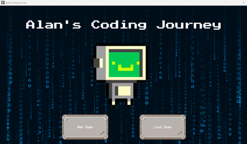
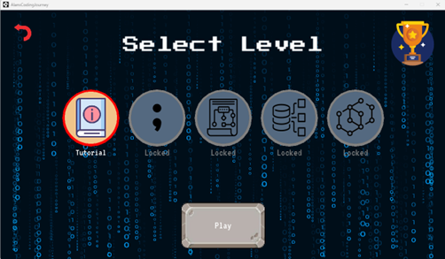
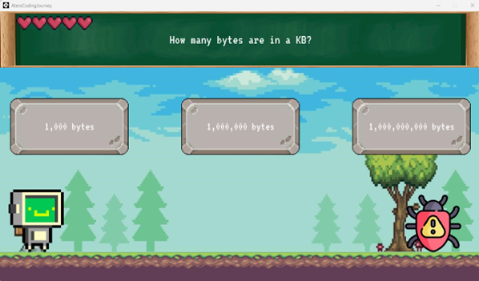
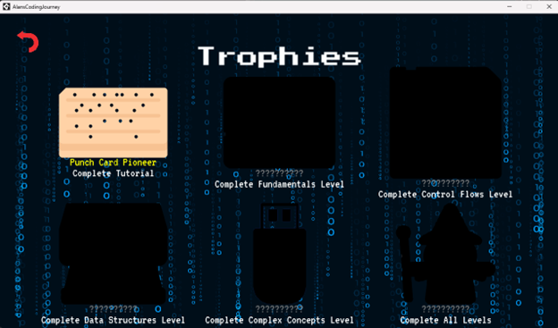
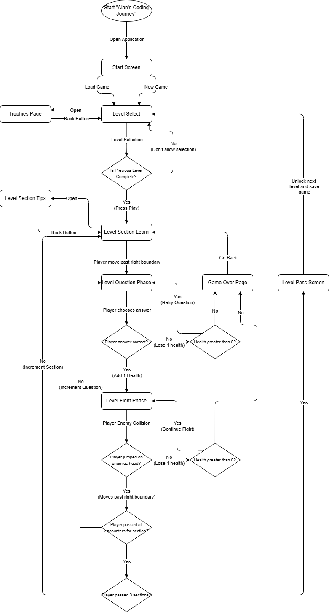

# Alan’s Coding Journey (GameMaker Studio 2 / GML / C)

This project implements *Alan’s Coding Journey*, a single-player educational side-scrolling game that teaches beginner programming concepts in C through platforming encounters and coding questions. It consists of a *GameMaker Studio 2* project (`AlansCodingJourneyC.yyp`) with organized *Rooms*, *Objects*, *Sprites*, and *Fonts*, plus design documentation (Game Manual + Storyboard). The game is distributed as a Windows installer for players, or can be run from the GameMaker IDE for development.

## Features
- Single-player side-scrolling platformer with level-based progression
- Educational coding questions with immediate feedback (correct/incorrect)
- Two-part encounters: answer a question, then defeat the enemy (jump to attack)
- Health (hearts) system with visual feedback (flashing/invincibility when hit)
- Expandable learning/tips panels to explain concepts during gameplay
- Randomized question/answer variants per encounter
- Save/load progress (unlocks + trophies preserved between sessions)
- Trophy/Achievement screen tied to level completion

---

## Requirements
**For Players (User Install)**
- Windows 10/11
- 4 GB RAM
- Dedicated graphics card
- 500 MB available storage
- Display resolution: 1280x720 or higher
- Keyboard + mouse

**For Developers**
- GameMaker Studio 2 (IDE)
- Windows 10/11
- Quad-core CPU
- 8 GB RAM
- Dedicated graphics card
- 3 GB available storage
- Internet connection (to install tools / clone repo)
- Optional: graphics software for asset creation (e.g., Krita)

---

## Project Layout
AlansCodingJourney/
- `docs/`
  - `documentation/`
  - `screenshots/`
- `src/`
	- `AlansCodingJourneyC/`
		- `fonts/`
		- `objects/`
		- `options/`
		- `rooms/`
		- `scripts/`
		- `sprites/`
		- `AlansCodingJourneyC.resource_order`
		- `AlansCodingJourneyC.yyp`
	- `AlansCodingJourneyInstaller.exe/`

---

## Setup and Running
1. Download or clone this repository.
2. **Players:** install the game using the Windows installer (details in “Running the Game (Players)” below).
3. **Developers:** open the project in GameMaker Studio 2 (details in “Running the Game (Developers)” below).
4. Play through the tutorial and complete levels to unlock new content.
5. To exit the game, close the game window.

> **Note:** The playable build is distributed as a Windows installer. The source version is run by opening `AlansCodingJourneyC.yyp` in *GameMaker Studio 2*.

### Running the Game (Players)
1. Download the Windows installer (`AlansCodingJourneyInstaller.exe/`).
2. Double-click the installer to begin the installation process.
3. Follow the on-screen prompts to select installation location and create desktop shortcuts.
4. Once installation completes, launch the game through the created desktop shortcut or start menu entry. 

### Running the Game (Developers)
1. Install GameMaker Studio 2 from the [official GameMaker site](https://gamemaker.io/en).
2. Clone this repository or download as a *.zip* folder.
3. Open *GameMaker Studio 2* and load the project file:
	- Open `AlansCodingJourneyC.yyp`
	- Press Run inside the IDE to launch the game

---

## Playing the Game
- **Start Screen:** Choose '*New Game*' to begin or '*Load Game*' to continue from saved progress.
- **Level Select:** Pick an unlocked level; completed content unlocks the next level and trophies.
- **Learning + Tips Panels:** Use the in-game tips/learning panels to read explanations during each section.
- **Encounters:** Each level includes multiple encounters:
	- ***Question phase:*** answer the programming question correctly to proceed
	- ***Fight phase:*** defeat the enemy by jumping on it
- **Health (*Hearts*):** Incorrect answers or taking damage reduces hearts; reaching 0 triggers *Game Over*.
- **Trophies:** View unlocked trophies from the trophies screen (tied to level completion).
- **Level Progression Themes:**
	- ***Tutorial Level:*** Cherry Blossom Forest Pass
	- ***Fundamentals Level:*** 8-bit Grassy Path (Bug Enemy)
	- ***Control Flows Level:*** Rocky Waterfall Path (Virus Enemy)
	- ***Data Structures Level:*** Dark Swamp Path (Corrupted USB Enemy)
	- ***Complex Concepts Level:*** Rainforest Path (Trojan Horse Enemy)

---

## Troubleshooting
- If the game fails to launch, close other applications/free resources and try reinstalling.
- If the save file is not loading, delete `savedata.sav` and restart the game (this resets saved progress).
- If controls become unresponsive, disconnect extra input devices and restart the game.
- If you see a black screen on startup, verify Windows display settings and update graphics drivers.
- If you get *“File not found”*, reinstall to restore missing assets.
- If learning panels fail to display, restart the game.
- If the game runs slowly, close background applications (*Task Manager*) and retry.

---

## Demo / Screenshots
- **Start Screen:** 
  

- **Level Select Screen:** 
  

- **Question Encounter Screen:** 
  

- **Trophies Screen:** 
  

- **System Flowchart:**  
  
