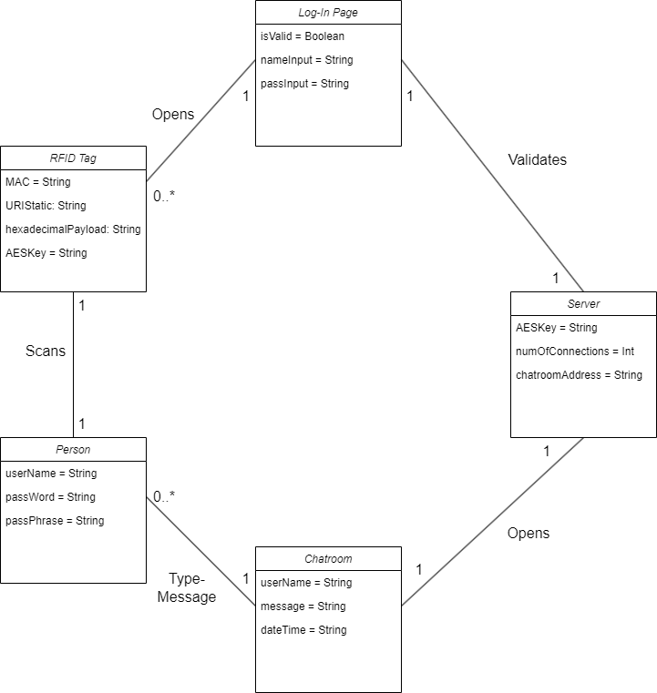

# RFID Chat Room (HTML / CSS / JavaScript / Node.js / AES-256 / RFID / NFC)

This project is a secure web-based chatroom application that uses RFID/NFC tag–based access control and client-side AES message encryption. Users start from an RFID tag URL (e.g., `/login/tag1`). The server validates the tag against a SQLite database (`rfid.db`), verifies a password, then issues a session ID. After login, the client connects over WebSockets and messages are broadcast as encrypted payloads (encryption/decryption happens in the server using `CryptoJS`).

## Features
- RFID/NFC tag-based entry (tag scan opens a tag-specific login route)
- 3-step verification process (RFID tag → passphrase → password)
- Real-time chat using WebSockets
- Client-side AES encryption (encrypted text is what the server receives/broadcasts)
- Session validation and access enforcement (unauthorized access / refresh / invalid session shows access errors)
- Server-side logging for authentication, session creation, connections, and message relays

---

## Requirements
- Node.js (LTS recommended) + npm
- Web browser (Chrome/Edge recommended)
- SQLite (if your build uses a local `.db` file)
- Internet connection recommended
- RFID/NFC tag + NFC-capable phone (or NFC reader) for authentication flow
- Command Prompt/Terminal (local)

---

## Project Layout
RFIDChatroom/
- `docs/`
  - `documentation/`
  - `screenshots/` 
- `src/`
  - `server.js`
  - `package.json`
  - `package-lock.json`
  - `rfid.db`
  - `public/`
    - `login.html`
    - `chat.html`
    - `images/`

> **Important:** `server.js` serves static files from `public/`, so `login.html` and `chat.html` must be inside that folder.

---

## Setup and Running
1. Download or clone this repository.
2. Navigate to the RFID chatroom project directory.
3. Install dependencies (details in “Running the Server” below).
4. Start the server.
5. Access the client in a browser and authenticate using the RFID/NFC flow (details in “Running the Client” below).


### Running the Server
1. Open Command Prompt/Terminal and navigate to the project `src/` directory.
2. Install dependencies:
```bash
    npm install
```
3. Start the server
```bash
    npm start
```
> The server will start listening on `http://localhost:3000` (default).

> You can change the port by setting `PORT`: 

```bash
    PORT=8080 npm start
```

### Running the Client
1. With the server running, open a web browser (Chrome/Edge recommended).
2. Start the RFID/NFC login flow by navigating to the login route using a valid tag ID:
   - `http://localhost:3000/login/tag1`

> `tag1` must exist in the `rfid_tags` table inside `rfid.db`.

3. Enter the password for that tag and click **Login**.

> If authentication is successful, the server will create a session and automatically redirect you to the chatroom page (URL includes a session query parameter):
- `http://localhost:3000/chat.html?session=<sessionId>`

4. To simulate multiple users, open a second browser window (or an incognito window) and log in with a different tag:
   - `http://localhost:3000/login/tag2`

> Use a different tag/username to avoid duplicate login restrictions.

5. Once inside the chatroom, type a message and click **Send** (or press Enter). Messages will appear in real time for all connected clients.

### Using the Client GUI Window
- To send a message, type in the message input field and click **Send** (or press Enter).
- Messages are transmitted as encrypted payloads and displayed in the chat window with the sender name and timestamp.
- If your session becomes invalid (refreshing without a valid session, or unauthorized access), the client will display an **Unauthorized Access** or **Connection Lost** page.

---

## Troubleshooting
- **Invalid RFID tag:** the `tagId` in `/login/:tagId` is not in `rfid.db`.
- **Unauthorized Access:** you opened `chat.html` directly without a valid `session` query parameter.
- **Two users can’t read each other’s messages:** check how `encryption_key` is stored per tag and ensure clients are using compatible keys.
- **Port already in use:** run on a different port using:

```bash
PORT=#### npm start
```

---

## RFID Tag Database Notes
The project uses a SQLite database named rfid.db with a table:
- rfid_tags(tag_id, password, username, encryption_key)

To add/edit tags:
1. Open rfid.db using a SQLite tool (ex: DB Browser for SQLite).
2. Insert/update rows in rfid_tags.

> For successful decryption between users, the participating clients must be using compatible encryption keys (depending on how you’ve populated encryption_key for each tag).

---

## Hosting *(Optional)*
To make the chatroom available over the internet, deploy this project to any Node.js host that supports:
- WebSockets
- Serving static files from `public/`
- Access to the SQLite database (or replace SQLite with a hosted DB)

---

## Demo / Screenshots
- **Login Screen:** 


- **Chatroom Screen:** 


- **Domain Model Diagram:**  
