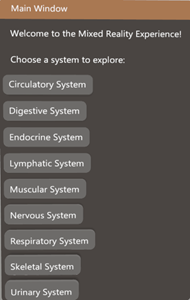
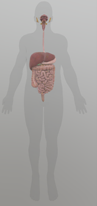
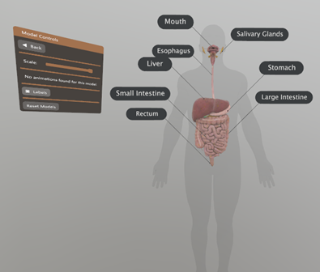
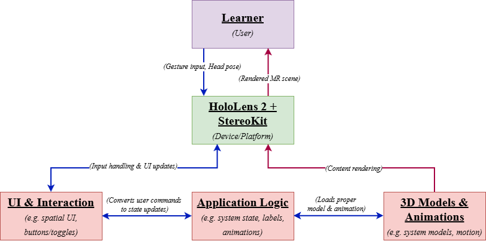
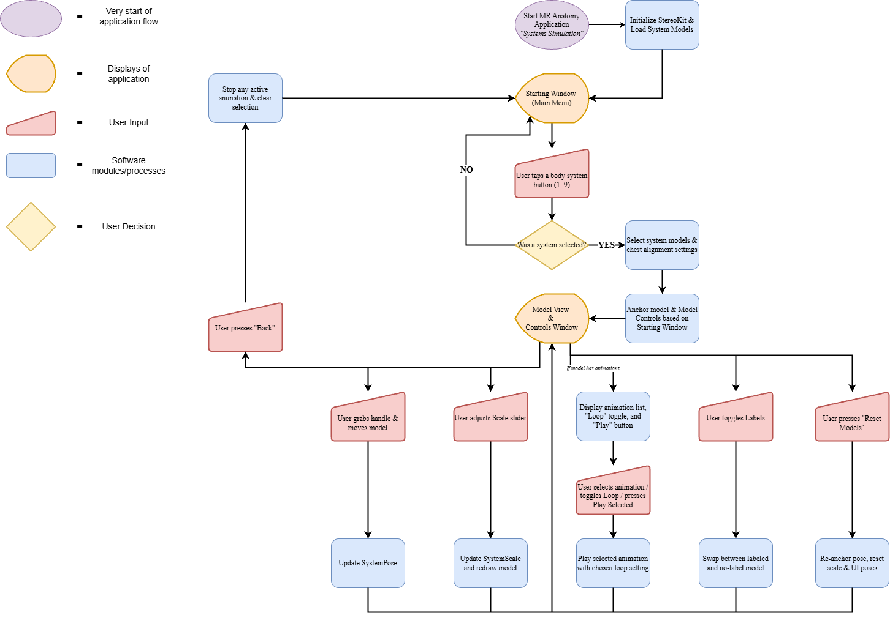

# Systems Simulation (C# / .NET / StereoKit / HoloLens 2)

This project implements *Systems Simulation*, a reusable mixed reality (MR) application framework for interactive exploration of complex 3D systems. Built in C# with the *StereoKit* framework and developed in *Visual Studio 2022*, the initial implementation targets *Microsoft HoloLens 2* and organizes multiple anatomical body systems within a shared application. The project separates 3D content (GLB assets) from scene logic (UI, state, model loading) to keep the prototype modular and easy to extend.

## Features
- Main Menu (“Starting Window”) with one selectable button per body system
- Consistent interaction layer across all systems (grab/reposition, scale, reset)
- Model Controls window with:
  - Back button (returns to main menu)
  - Scale slider
  - Labels toggle (switches between labeled and no-label model variants)
  - Animation controls (when available)
  - Reset Models button (restores default pose/orientation/scale)
- Content library approach via `Assets/` (paired labeled + no-label GLB files)
- Optional pre-optimized `.opt.glb` assets (via `gltfpack`) for performance on HoloLens 2
- Desktop-first iteration using the StereoKit simulator, with optional Holographic Remoting for headset testing, however is meant to be device-agnostic

---

## Requirements
- Windows 10/11 PC
- Visual Studio 2022
- C# / .NET (via Visual Studio workloads)
- StereoKit (project dependency)
- *Optional (for device testing):* Microsoft HoloLens 2
- *Optional (for faster iteration on-device):* Microsoft Holographic Remoting
- *Optional (for device management/view mirroring):* Microsoft HoloLens Desktop Application
- *Optional (for content work):* Blender + `gltfpack` (for GLB optimization)

---

## Project Layout
SystemsSimulation/
- `docs/`
  - `documentation/`
  - `screenshots/`
- `src/`
  - `HoloUWP/`
    - `Assets/`
    - `Properties/`
    - `Scene/`
    - `Package.appxmanifest`
    - `Program.cs`
    - `HoloUWP.csproj`
  - `HoloUWP.sln`

---

## Setup and Running
1. Download or clone this repository.
2. Open the solution (`src/HoloUWP.sln`) in Visual Studio 2022.
3. Build and run using the **StereoKit simulator** on the desktop PC to validate menu logic, UI behavior, scaling, and model placement.
4. *(Optional)* Use **Holographic Remoting** to stream the application from the PC to a **HoloLens 2** for on-device viewing and interaction during development.

> **Note:** A standalone installer/release build is not currently provided as software is device-agnostic. This repository is intended to be built on source and deployed to prefered MR device.

---

## Troubleshooting
- If a model fails to load, confirm the expected files exist in `Assets/` (including both labeled and `NL` variants) and that names match what’s referenced in `SystemsModels.cs`.
- If an optimized `.opt.glb` fails to load (especially for complex animations), use the original uncompressed `.glb` version instead.
- Development logging is done via `System.Diagnostics.Debug.WriteLine` in development builds; use Visual Studio’s Output window to inspect model loading and animation/debug messages.
- If performance is slow on-device, prefer pre-optimized `.opt.glb` assets where compatible.

---

## Demo / Screenshots

- **Main Window:** 

  

- **Digestive System Model:** 
  
  

- **Model with labels on and Model Controls Window:** 
  
  

- **High Level System Diagram:** 
  
  
  

- **System Flowchart:**  
  
  
  
