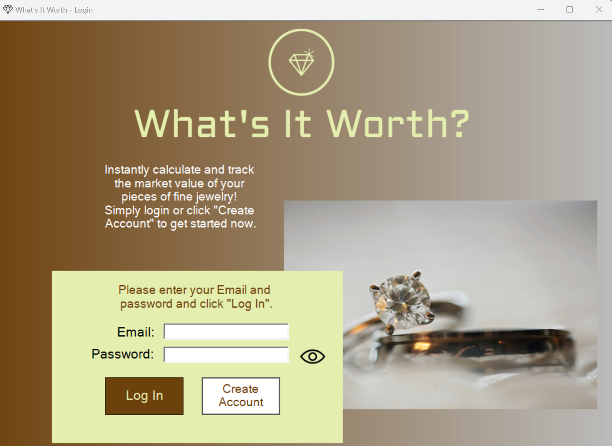
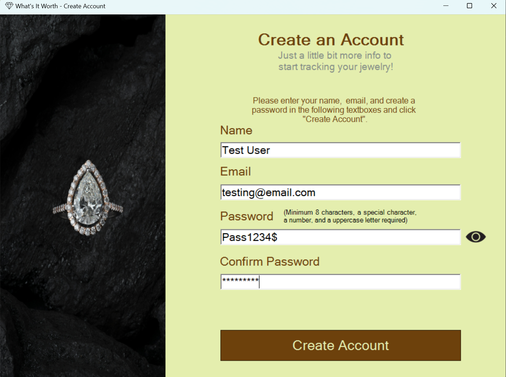
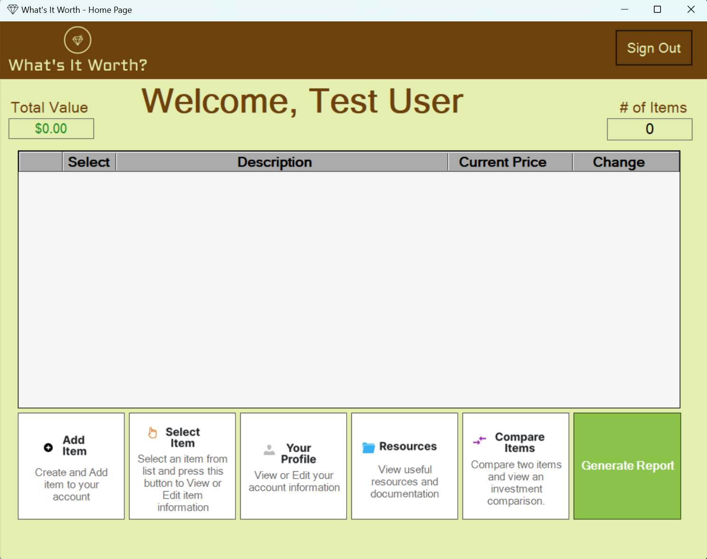
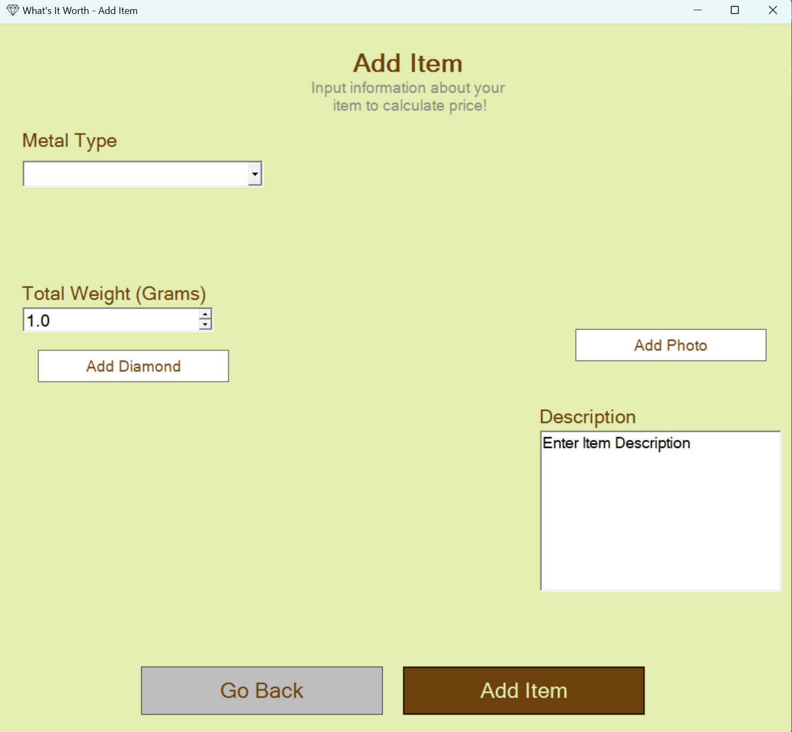
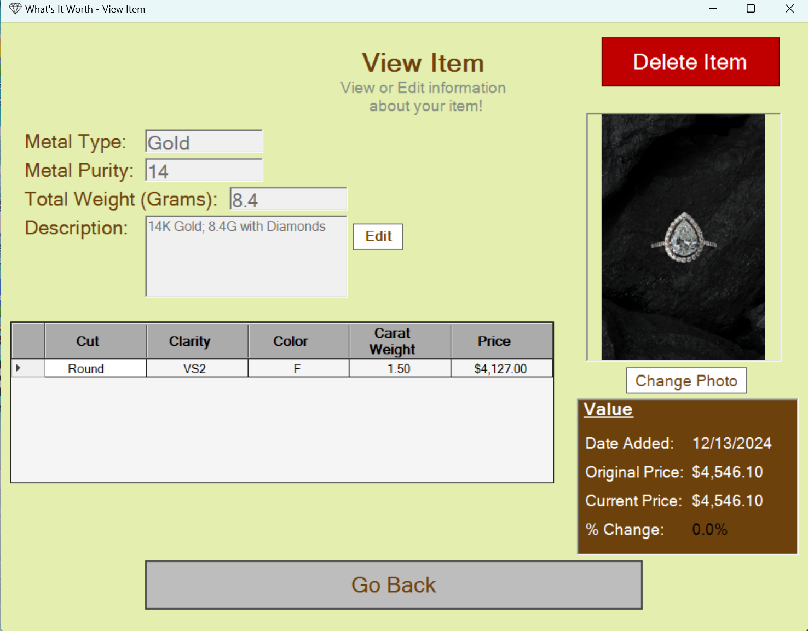

# What's It Worth? (C# / WinForms / .NET / SQL)

This project implements *What’s It Worth?*, a Windows desktop application that helps users calculate and track the market value of jewelry materials (precious metals + diamonds). The application supports account creation, item management, and price updates through an internet connection, while storing user data locally in a bundled SQLite database for instant deployment.

> **Documentation Note:** The UI/screens and user flow in the manuals are accurate, but some legacy database/setup instructions reference SSMS from an earlier version. This repository’s current implementation uses a local SQLite `.db` file bundled with the app, requiring no database installation or configuration.

## Features
- Create and manage a user account (create, log in/out, edit, delete)
- Maintain a personal jewelry inventory (add/view/select/delete items, including metal type details and optional photos)
- Add diamond information based on real-time auction pricing using API
- View item-level and collection-level valuation summaries, including totals and comparisons
- Generate a basic report/summary of the collection’s estimated valuen
- Store all data securely in a local SQLite database
- Update precious-metal pricing online and recalculate item values

---

## Requirements
**For Users (User Install)**
- Windows 10/11
- 4GB available storage
- Display resolution: 1280x720 or higher
- Keyboard + mouse
- Internet connection
- .NET Framework

**For Developers**
- Windows 10/11
- Visual Studio 2022
- 4GB available storage
- .NET Framework 4.8 Developer Pack
- Internet connection
- Optional: database viewing and management software (e.g., DB Browser)

---

## Project Layout
WhatsItWorth/
- `docs/`
  - `documentation/`
  - `screenshots/`
- `src/`
	- `developer`
		- `WhatsItWorth/`
		- `WhatsItWorth.sln`
	- `user`
		- `WhatsItWorth.zip`

---

## Setup and Running
1. Download or clone this repository.
2. **Users:** download and run the application using the packaged zip (details in “Running the Application (Users)” below).
3. **Developers:** open and run the solution in Visual Studio (details in “Running the Application (Developers)” below).
4. Use the seeded test account (optional) to explore the full feature set immediately..
5.  To exit the application, close the application window.

> **Note:** This version uses a bundled SQLite database (`.db`) stored in the application’s `Database/` folder. No database installation or configuration is required. The release build uses the included `testDatabase.db`. Debug builds may generate/use a build-specific database automatically (no user action required; logic is documented in code comments).

### Running the Application (Users)
1. Download `src/user/WhatsItWorth.zip`.
2. Extract the zip folder anywhere on your computer.
3. Run `WhatsItWorth.exe`.
4. (Optional) Log in with the seeded demo account:
	- *Email:* `test@gmail.com`
	- *Password:* `Pass1234$`

### Running the Application (Developers)
1. Open `src/developer/WhatsItWorth.sln` in Visual Studio.
2. Build the solution.
3. Run the project from Visual Studio (Start / F5).

---

## Using the Application
- **Login / Create Account:** Create a new account or log in with an existing account (the UI validates inputs and prevents invalid submissions).
- **Home Page:** View your collection overview and access item-management actions.
- **Add Item:** Add a new item by selecting its attributes and optionally attaching a photo.
- **Add Diamond:** Add diamond details and if a diamond is found, it will be added to the item.
- **View Item:** Select an item to view its stored details and valuation information.
- **Delete Item:** Remove an existing item from your collection.
- **Resources:** View resources and additional information for the application. (Opens in browser)
- **Generate Report:** Generate a simple report of inventory that can be saved or printed.
- **Demo Account (Optional):** Use the seeded “Test User” to immediately see example items and app functionality:
	- *Email:* `test@gmail.com`
	- *Password:* `Pass1234$`

---

## Troubleshooting
- If the app does not launch, ensure **.NET Framework 4.8** is installed/enabled on Windows.
- If prices are not updating, verify you have an active **internet connection**.
- If you cannot add diamonds, verify you have an active **internet connection**.
- If the app runs but shows no items, log in with the seeded demo account (`test@gmail.com` / `Pass1234$`) to confirm expected behavior.
- If images do not appear for an item, re-add the photo and confirm the file remains available at the selected location.
- If you suspect database corruption, re-extract `WhatsItWorth.zip` to restore the bundled `testDatabase.db`.

---

## Demo / Screenshots
- **Login Screen:** 
   

- **Create Account Screen:** 
  

- **Home Page:** 
  

- **Add Item Screen:** 
  

  - **View Item Screen:**  
  
